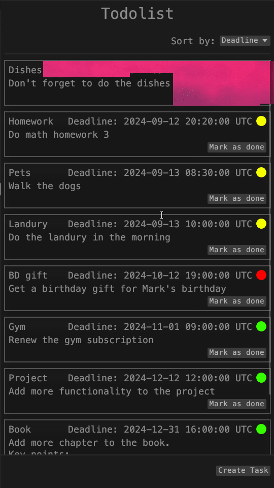
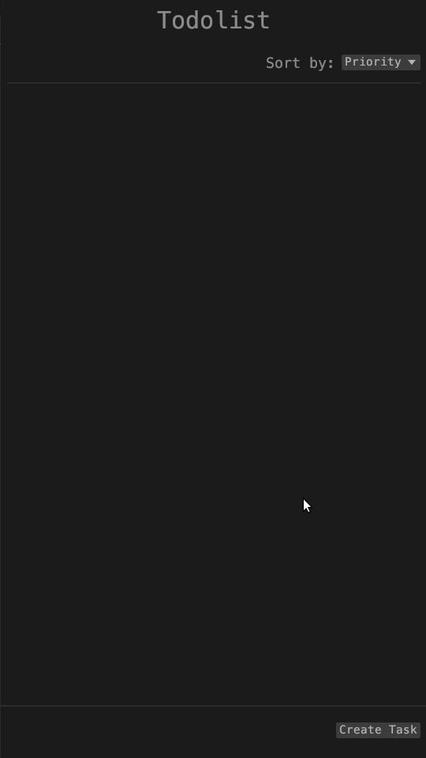

# Rust TodoList GUI App with `egui` and `diesel`

This is a simple **todolist application** built with Rust, utilizing the `egui` library for the frontend and `diesel` for database interactions and backend functionality.

## Features
- **Intuitive GUI** for managing your tasks, built with `egui`
- **SQLite Database Integration** using `diesel`
- **Tasks Persistence**: All tasks are saved to the database

## Demo
Here are some GIFs showcasing the main features of the todolist application:

1. **Task Management Interface**  
      
      *Users can interact with tasks by marking them as completed or sorting them.*

2. **Adding a New Task**  .

      
    *See how a new task is added to the list with the click of a button.*


## Installation
To run this project locally, ensure you have [Rust](https://www.rust-lang.org/tools/install) and [Diesel CLI](https://diesel.rs/guides/getting-started) installed.

1. Clone the repository:

    ```bash
    git clone https://github.com/yourusername/your-repo-name
    ```

2. Navigate into the directory:

    ```bash
    cd your-repo-name
    ```

3. Set up your `.env` file with the correct `DATABASE_URL` for SQLite:

    ```bash
    echo "DATABASE_URL=./database/db.sqlite" > .env
    ```

4. Set up the database (ensure `diesel` CLI is installed):

    ```bash
    diesel setup
    ```

5. Run the app:

    ```bash
    cargo run
    ```

### Requirements
- Rust
- Diesel CLI
- SQLite

## Usage
_Describe briefly how users can interact with the todolist app or any important usage instructions._

1. **Step 1**: Set up your database connection in the `.env` file as shown above.
2. **Step 2**: Setup diesel using `diesel setup`.
2. **Step 3**: Run the app using `cargo run`.
3. **Step 4**: Add, update, and manage your tasks using the GUI interface!

## Future Work
Here are some planned enhancements for future versions of the application:

- **Improved Font Styles**: Enhance the appearance and readability of text, adding different styles for different widgets.
- **Task Tags**: Add tagging functionality for tasks to better categorize and filter them.
- **Interface Enhancements**: Improve the overall user interface for a more intuitive experience.


## Contributing
Feel free to fork this project, submit issues, or contribute via pull requests. Contributions are welcome!

## License
This project is licensed under the MIT License - see the [LICENSE](LICENSE) file for details.
